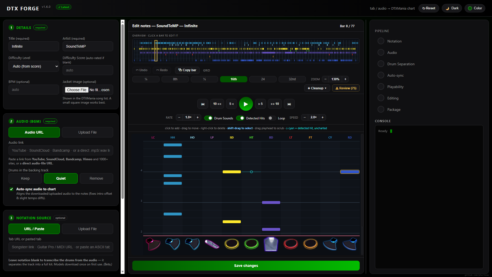
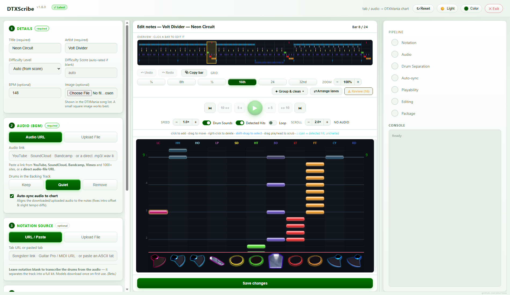

# DTXScribe

Turn a drum tab (or just audio) into a fully playable **DTXMania** chart - **no manual notation**.
It fetches the tab, grabs the song, auto-syncs the audio, applies realistic foot technique,
verifies a human can actually play it, and packages a ready-to-drop `.dtx` zip.

Built from a pipeline verified to place ~99% of charted notes within ±10–20 ms of the real recording.



*Dark and light themes, with the built-in chart editor open.*



**Coming next:** record your own charts by playing an electronic drum kit - see the [Roadmap](ROADMAP.md).

---

## Highlights

- **Notation optional - audio is enough.** Paste a **Songsterr** URL, a **Guitar Pro** / **MIDI** URL,
  an **ASCII drum tab**, or a file - or **leave notation blank** and DTXScribe transcribes the drums
  straight from the audio into a **full kit** (kick, snare, toms, open/closed hi-hat, ride, crash).
- **Real audio from almost anywhere.** Paste a link from **YouTube, SoundCloud, Bandcamp, Vimeo** and
  1000+ sites, a **direct audio-file URL**, or upload a file. DTXScribe auto-syncs it to the chart.
- **Full song by default.** Keep the complete track, quiet the drums, or fully remove them (arcade feel).
- **Difficulty tiers that rate, not restrict.** Pick a level - **Basic / Advanced / Extreme / Master** -
  or let **Auto** derive it from a 0.00–9.99 score rated against a skilled-player reference. The tier is a
  **rating of density and complexity, not a note-value ceiling**: a chart of any difficulty keeps whatever
  quarter / 8th / 16th / triplet / 32nd notes the song actually plays (real GITADORA charts of every tier
  mix note values freely). The output `.dtx` is named by tier (`bsc` / `adv` / `ext` / `mstr`), the
  DTXMania / GITADORA convention.
- **Authentic foot technique.** In **DTXMania** style, left-foot hi-hat on the **2 & 4 backbeat** and
  **DKDK** double-bass (converting only the kicks too fast to play one-legged) are applied automatically,
  gated by difficulty (Master gets the hi-hat foot **and** double bass; lower tiers little or none) to match
  real GITADORA charts.
- **Human-playability check.** Every chart is verified against a 2-hands + 2-feet model and
  auto-relaxed if a passage is physically impossible.
- **Faithfulness score.** When charting from a tab, each chart reports how true it is to the tab -
  **100% = untouched** - and shows exactly what changed (notes moved to the left foot, dropped, or added).
- **Live pipeline visualizer.** Watch each stage light up as it runs.
- **Built-in chart editor.** After generating, open a DTXMania-style editor (colored lanes, one bar at a
  time) to finish the chart by hand:
  - **Standard transport** - play/pause, back/forward 5s & 10s, previous/next bar, a rate control
    (slow/fast, pitch-preserved), and a draggable playhead that scrubs the audio.
  - **Edit** - click to add, drag to move, right-click to delete, and **shift-drag to select** a region,
    then copy / paste / delete it (with a right-click menu). Full **undo/redo** and keyboard shortcuts.
  - **Review layer** - the app marks where it heard a drum hit but charted nothing near it, and a Review
    button steps you through the spots worth checking.
  - **Assisted copy/paste** - copy a bar and every repeat lights up in the overview; stamp your fix onto
    all of them at once.
  - **Bulk cleanups** - one-click, whole-chart fixes (rides → crash, thin hi-hats, clear toms).

  The chart is packaged once, on download, after your edits.
- **Song-select jacket.** Optionally upload an image; it's embedded as the chart's `#PREIMAGE`.
- **Personalize it.** Light/dark themes + an accent color picker (remembered between runs).

---

## Install - pick ONE

There are two independent ways to run DTXScribe. You don't need both.

### Option A - Standalone app (no Python)
1. Download **`DTXScribe-EXE.zip`** from the [Releases](../../releases) page and unzip it.
2. Double-click **`DTXScribe.exe`**. That's it.

### Option B - From source (Python)
1. Install **Python 3.10+** - use the installer from <https://www.python.org/downloads/> and
   tick *Add Python to PATH*. (The Microsoft Store build works too, but only exposes `python`,
   not `pythonw`; the launcher handles that automatically.)
2. Double-click **`setup.cmd`** - installs dependencies and offers Demucs (needed for audio-only
   transcription and the *Quiet* / *Remove* drum modes, ~2 GB).
3. Run it:
   - **App window:** double-click **`DTXScribe.cmd`**, or
   - **Browser:** double-click **`run.cmd`** → opens <http://127.0.0.1:8765>.

Full-kit separation models (~160 MB + ~515 MB) download automatically the first time you
transcribe from audio with no tab (both options).

## Using it

Fill in **Title** and **Artist** (both required), pick your sources, hit **Generate**, download the zip.

## Install a chart

Unzip the downloaded `Artist - Title.zip` into your DTXMania songs folder
(e.g. `DTXMania\...\Songs\`). Launch DTXMania → it rescans → play.

## Uninstall / free up space

DTXScribe is portable - to remove the app, just **delete its folder**. Nothing is written to the
registry or Program Files.

The one thing left outside the folder is the drum-separation **model weights** it downloads on first
use (often **1 GB+**), under `%LOCALAPPDATA%\DTXScribe`. For a thorough cleanup, run
**`uninstall.cmd`** - it lists everything DTXScribe put on your PC (model weights, cache, logs, any
older pre-rebrand data, Demucs weights and shortcuts) with sizes, asks before removing anything, and
can optionally delete the program folder itself at the end. Your saved `.dtx` charts are never
touched.

---

## How the pieces work

- **Notation** - Songsterr / Guitar Pro / MIDI / ASCII → true-meter, 1/64-quantized DTX (odd-meter
  overflow notes merged so the chart stays tempo-locked). Or, with no tab, the drums are transcribed
  from the audio (see below).
- **Audio** - any yt-dlp-supported link (YouTube, SoundCloud, Bandcamp, Vimeo, 1000+ sites), a direct
  audio-file URL, or a file you upload. A bundled `deno` solves the JS challenge for sites (e.g. YouTube)
  that need it.
- **Auto-sync** - cross-correlates your audio against the tab-synced master to find the exact offset,
  then trims to align. Tempo is trusted from the tab (same song = same tempo).
- **Full kit (audio-only)** - separates the drum stem into individual pieces and onset-detects each, so
  toms and ride are recovered - not just kick/snare/hat.
- **Foot technique** - left-foot hi-hat on 2 & 4 and DKDK double-bass, written to lane 1B with the correct
  samples. Manual in Transcribed style; in DTXMania style it's automatic and tier-gated (and the left foot
  never plays a hi-hat chick and a double kick on the same tick).
- **Difficulty** - choose a tier (Basic / Advanced / Extreme / Master) or let **Auto** map it from a
  0.00–9.99 score (note density, peak bursts, limb speed, kit variety), referenced to a player with some
  drum skill. Tier boundaries: Basic < 3.00 · Advanced 3.00–5.99 · Extreme 6.00–8.49 · Master ≥ 8.50. The
  tier is a **rating only - it never caps note values**: the chart keeps the song's real 16th / triplet /
  32nd content at any difficulty (grounded in 4,700+ real GITADORA charts, where even Basic charts contain
  16ths and triplets). The chart file is named by tier (`bsc.dtx` / `adv.dtx` / `ext.dtx` / `mstr.dtx`) in
  its `set.def` slot.
- **Playability** - flags any foot/hand asked to move faster than humanly possible, and relaxes it.
- **Package** - Shift-JIS `.dtx` + BGM + a synthesized drum kit, zipped.

## Audio downloads & usability

Most links download **anonymously, no login**. If a site bot-blocks the network (e.g. YouTube), DTXScribe
automatically borrows your browser's existing session for that site (Firefox/Chrome/Edge/Brave) - you
never log into DTXScribe itself. If everything is blocked, **Upload file** always works.

## Sources it can read

The URL box (and file upload) auto-detect the source - you don't pick a type:

| Source | How |
|--------|-----|
| **Songsterr** | Paste any tab link or the numeric id. Structured note data → exact chart. |
| **Guitar Pro** | `.gp` / `.gp3` / `.gp4` / `.gp5` / `.gpx` - URL or file. Percussion track → GM drums. |
| **MIDI** | `.mid` / `.midi` with a GM drum track (channel 10). |
| **ASCII drum tab** | Paste text like `HH|x-x-x-x-|` (Ultimate-Guitar style), or a `.txt`/URL. |
| **Audio only** *(beta)* | No tab at all - the drum track is separated into pieces and transcribed. Fully automatic. |

The dividing line isn't the website - it's whether the source has **machine-readable notes** vs. a
picture of notes. Photos/PDFs of sheet music aren't supported (that needs optical music recognition).

### Audio-only drum detection *(automatic, when notation is blank)*

DTXScribe runs two complementary separation models and fuses their strengths - there's **no engine to
pick**:

| Piece | Recovered by |
| --- | --- |
| kick, snare, toms (high / low-mid / floor) | drum-body separation |
| open & closed hi-hat, ride, crash | hat / cymbal separation |

Models download once to `%LOCALAPPDATA%/DTXScribe` and are **not** bundled; if they can't be fetched, a
fast built-in kick/snare/hat detector covers the basics. Toms are pitch-split into high/low-mid/floor and
cymbals into crash/ride. See `LICENSE` for model attributions (one model's weights are CC BY-NC).

**Audio-only style - Raw · Standardize** (in the **Advanced** card, only when notation is blank).
**Raw** emits exactly what was detected (busiest, closest to the audio). **Standardize** (default)
quantizes **each bar to its own natural subdivision** - quarter, 8th, 16th, 32nd or triplet, whichever
that bar actually plays - so a sparse bar stays sparse and a fast fill stays fast, then removes doubled /
jittered / physically-impossible notes. Per-bar density mirrors the song.

**Chart style - Transcribed · DTXMania** (in the **Advanced** card, works for *both* a supplied tab
and audio transcription). **Transcribed** keeps the chart as generated from your source. **DTXMania**
regularizes it into idiomatic patterns - steady, evenly-spaced timekeeping at the difficulty's resolution
and one timekeeper (hi-hat *or* ride) per section - and adds authentic left-foot technique automatically by
difficulty, so it reads like a real DTXMania / GITADORA chart. These conventions were tuned against an
analysis of **2,000 published GITADORA charts** (crashes stack freely with kick/snare as in real charts; the
left foot plays a hi-hat chick *or* a double kick, never both at once). When DTXMania is selected, the
Audio-only and Foot Technique controls are handled for you.

## Notes & limits

- Songsterr tabs are often **auto-generated** - a strong approximation, not a hand-verified chart.
- **Audio-only** transcription (no tab) is beta: the drum stem is separated into pieces, then each is
  onset-detected and standardized (see above). Tempo is auto-detected with octave correction, but on some
  songs it can still land on the wrong multiple - set BPM manually if it looks doubled/halved (note
  placement follows the audio either way).
- **Spotify links aren't supported** (the audio is DRM-protected and can't be downloaded). Use a YouTube /
  SoundCloud / Bandcamp link, a direct audio-file URL, or **Upload file**.
- Auto-sync assumes the upload is the same tempo as the song; disable it for nightcore/sped-up rips.

## Layout

```
dtx-scribe/
  app.py  desktop.py           server + native window
  DTXScribe.cmd  run.cmd  setup.cmd  uninstall.cmd
  dtxscribe/
    songsterr.py  audio.py  autosync.py   fetch, download, align
    transcribe.py  dtx.py  humanize.py     notes, emit, foot technique
    playability.py  notes.py  report.py    checks, helpers, stage events
    difficulty.py  faithfulness.py         auto-rating, tab fidelity
    fullkit.py  larsnet_engine.py          audio-only full-kit separation
    standardize.py  simplify.py            grid-quantize + difficulty thinning
    dtxmania_style.py                      idiomatic-pattern regularizer
    vendor/larsnet_unet.py                 vendored model architecture
    drumkit.py  pipeline.py                samples, orchestration
  web/index.html                           UI (themes, picker, visualizer)
  assets/drumkit/  assets/bin/deno.exe     samples + JS runtime
  jobs/                                    per-run work + output zips
```
